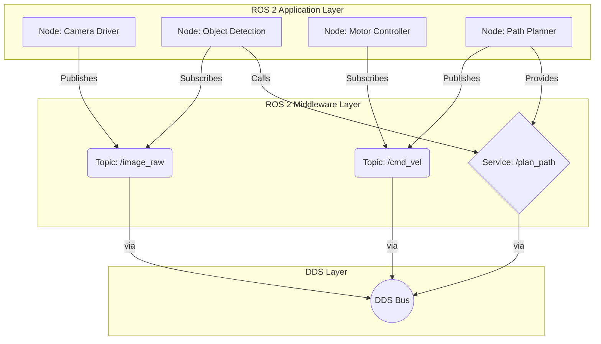
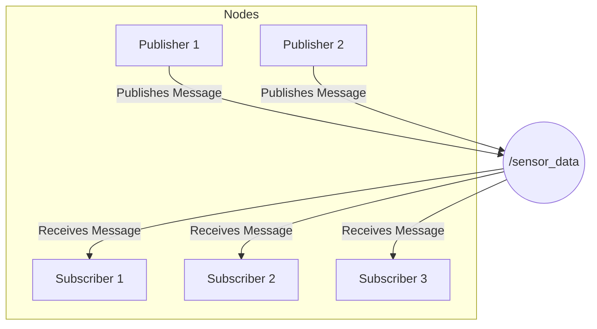
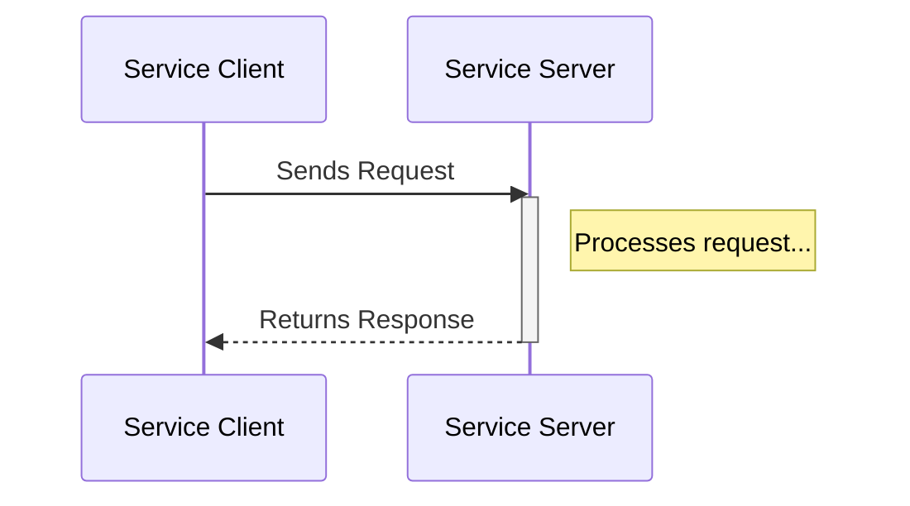
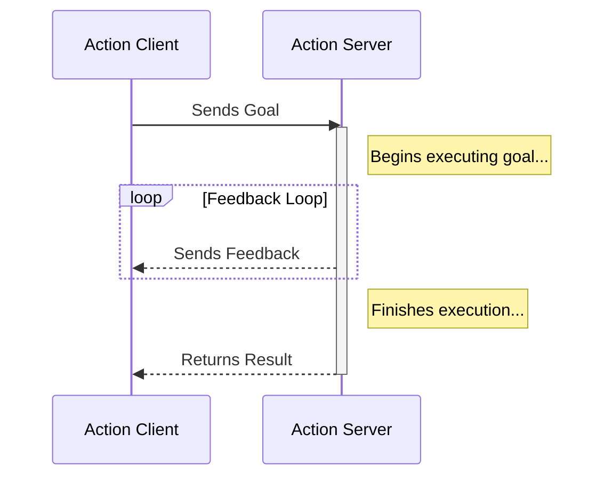

## 1. ROS 2 Architecture Overview

At the heart of ROS 2 lies a distributed, graph-based architecture designed for flexibility and scalability. Unlike a monolithic program, a ROS 2 system is composed of many independent, executable programs called **nodes**. These nodes communicate with each other over a network, enabling them to work together to achieve a common goal, such as navigating a robot.

The magic of ROS 2 is that these nodes don't need to know where the other nodes are or even if they exist. They discover each other at runtime using a middleware standard called the Data Distribution Service (DDS). This creates a decentralized "graph" of communication, where nodes can be added, removed, or restarted without bringing down the entire system. This is a fundamental shift from ROS 1's centralized master-based architecture and is key to ROS 2's improved robustness and multi-robot capabilities.



The four primary communication patterns that form the building blocks of this architecture are Nodes, Topics, Services, and Actions.

## 2. Nodes: The Basic Building Blocks

A **node** is the fundamental unit of execution in ROS 2. Think of a node as a single, self-contained program that performs a specific task. Each node in a ROS system should be responsible for one, well-defined purpose. This modularity is a core principle of ROS.

**Key Characteristics:**
*   **Single Purpose:** A node might be responsible for controlling a wheel motor, reading data from a laser sensor, or planning a path for the robot to follow. Keeping nodes focused on a single task makes the system easier to debug, maintain, and reuse.
*   **Executable:** A node is an executable file that can be run from the command line. You can write nodes in various programming languages, with C++ and Python being the most common.
*   **Communication Hub:** Nodes are the entities that communicate. They can publish or subscribe to Topics, provide or request Services, and act as clients or servers for Actions.

**Example Use Case:**
In an autonomous mobile robot, you might have several nodes running concurrently:
*   A `camera_driver_node` that interfaces with the robot's camera and publishes raw image data.
*   A `lidar_driver_node` that publishes 2D laser scan data.
*   A `mapping_node` that subscribes to laser scans and builds a map of the environment.
*   A `navigation_node` that takes a goal location and publishes velocity commands.
*   A `motor_controller_node` that subscribes to velocity commands and controls the robot's wheels.

```python
# A conceptual Python example of a simple ROS 2 node
import rclpy
from rclpy.node import Node

class MySimpleNode(Node):
    def __init__(self):
        super().__init__('my_simple_node')
        self.get_logger().info('Node has been started.')

def main(args=None):
    rclpy.init(args=args)
    node = MySimpleNode()
    rclpy.spin(node)
    rclpy.shutdown()
```

## 3. Topics: The Publish-Subscribe Messaging Pattern

**Topics** are the primary mechanism in ROS 2 for continuous data streams. They operate on an anonymous **publish-subscribe** model. This means that one or more nodes can "publish" data to a topic, and one or more nodes can "subscribe" to that topic to receive the data. The nodes themselves are decoupled and don't know about each other's existence.



**Key Characteristics:**
*   **Asynchronous & Continuous:** Topics are designed for data that is generated continuously and doesn't require an immediate response, such as sensor readings, robot state, or control commands.
*   **Anonymous:** Publishers don't know who is listening, and subscribers don't know who is sending. They only need to agree on the topic name and the message type.
*   **Message-based:** Data is sent via strongly-typed messages. ROS provides many standard message types (e.g., `String`, `Int32`, `PoseStamped`) and allows you to define your own custom message types.

**Use Case Example:**
A robot's camera node would continuously **publish** `Image` messages to a `/camera/image_raw` topic. Any node that needs to process this visual data—such as an object detection node, a lane-following node, or a display node—would **subscribe** to this topic. They would all receive the same stream of images as they are published.

## 4. Services: The Request-Response Pattern

While Topics are great for continuous data streams, sometimes you need a synchronous, two-way communication pattern. This is where **Services** come in. A Service is defined by a request-response pair and allows one node (the "client") to send a request to another node (the "server") and wait for a response.



**Key Characteristics:**
*   **Synchronous:** When a client calls a service, it typically blocks (waits) until the server has processed the request and sent back a response.
*   **Two-way Communication:** Unlike topics, services are a direct, two-way interaction between a specific client and server.
-   **Strongly Typed:** Like topics, services have a defined type, which consists of two parts: the request message and the response message.

**Use Case Example:**
Imagine you have a node that can compute the inverse kinematics for a robot arm. You wouldn't want to stream joint angle requests continuously. Instead, a service would be more appropriate. A `planning_node` (the client) would send a `ComputeIK` service request containing the desired end-effector pose. The `ik_solver_node` (the server) would receive the pose, perform the calculation, and send back a `JointSolution` response containing the required joint angles. The `planning_node` waits for this specific answer before continuing its work.

## 5. Actions: For Long-Running Tasks

**Actions** are a more complex communication pattern designed for long-running, asynchronous tasks that need to provide feedback and be cancellable. They are essentially a combination of Topics and Services. A client sends a goal to an action server, but instead of waiting for an immediate response like a service, it can receive continuous feedback and a final result when the task is complete.



**Key Characteristics:**
*   **Asynchronous with Feedback:** The client doesn't block after sending a goal. It can go on to do other work while periodically receiving feedback on the task's progress.
*   **Preemptible:** The client can request to cancel the goal at any time. The action server is expected to handle this cancellation request gracefully and stop its execution.
*   **Three-part Communication:** The interaction involves a goal, a stream of feedback, and a final result.

**Use Case Example:**
Commanding a robot to navigate to a specific location is a perfect use case for an action. The task might take several minutes to complete.
*   **Goal:** A `user_interface_node` (the client) sends a goal to the `navigation_node` (the action server) with the target coordinates.
*   **Feedback:** As the robot moves, the `navigation_node` periodically sends feedback messages containing the robot's current position and distance to the goal. The UI can use this to display progress to the user.
*   **Result:** Once the robot reaches its destination, the `navigation_node` sends a final result indicating success or failure. If the user presses a "stop" button, the UI client can send a cancel request, and the navigation server will stop the robot.
